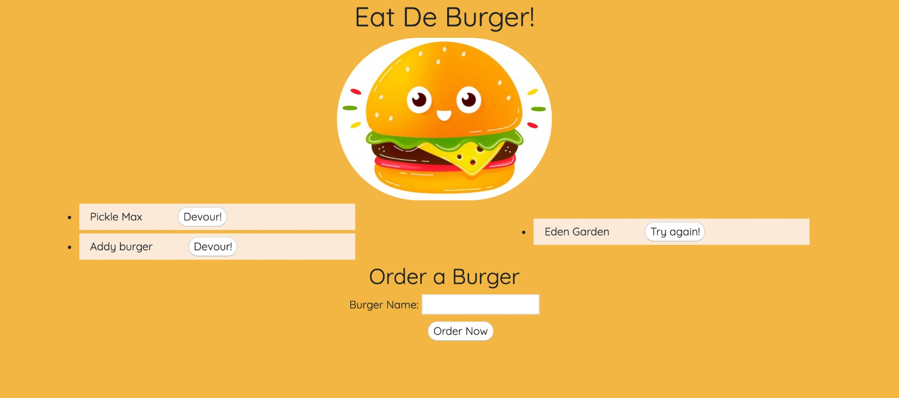

# Eat De Burger 🍔

Heroku link : https://damp-ravine-52208.herokuapp.com/

## Description

Eat De Burger is a restaurant application that allow user to enter the name of burger that they'd like eat, after 'order' placed, they can 'devour' it and remove the burger when they would like to 'try again'.

This application follow the MVC design pattern and logger with MySQL, Node, Express, Handlebars and ORM.

### Getting Started
- Create data base in MySQL by copy the codes in schema.sql.

- Install package.json by entering below command line in terminal.
```
npm install
```
- Open the browser and go to the localhost:8080

### How to use
After entre the burger name in the 'Order a burger' and press 'order now', the burger name will be saved in the data base and also show on the left side of the screen as a list.

If the user click 'devour!' buttom, the burger name will be display on the right side on the screen, which mean the data base has been updated. In detail, the 'devoured' column value for the specific burger has been updated.

On the right side, one the user clicked 'try again', the burger will bee remove from the data base.

## Acknowledgments
- MySQL
- Node
- Express
- Handlebars
- ORM
